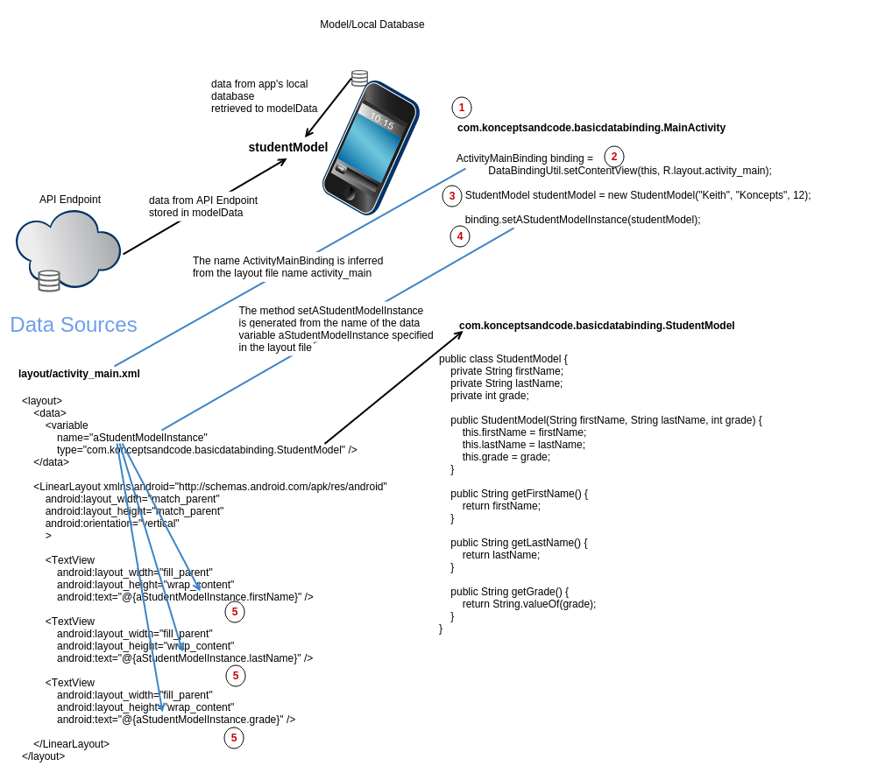

# Steps to use Data Binding

## Changes to the layout file

1) Enclose the layout file in <layout></layout> tags

2) Create a Data element and declare a variable to bind the data against 
```xml
    <data>
        <variable
            name="aStudentModelInstance"
            type="com.konceptsandcode.basicdatabinding.StudentModel" />
    </data>
```

3) Use a property from the data class

```xml
  <TextView
      android:layout_width="fill_parent"
      android:layout_height="wrap_content"
      android:text="@{aStudentModelInstance.firstName}" />
```

## Changes to the main Activity

1) Inflate the layout
```java
        /*
            Inflate the layout using DataBindingUtil class to create a binding class instance. 
            
            The binding class ActivityMainBinding is generated and its name is inferred from the layout file name 
            (activity_main, in this case)

            As the layout file name is called "activity_main", the binding class generated is called ActivityMainBinding

            DataBindingUtil.setContentView() returns the ViewDataBinding base class,
            but the generated class name should be used here
         */
        ActivityMainBinding binding =
                DataBindingUtil.setContentView(this, R.layout.activity_main);
```


2) Get the data (in this case, let's just initialize a model)

```java
        StudentModel studentModel = new StudentModel("Keith", "Koncepts", 12);
```

3) Binding the data to the view

```java
        binding.setAStudentModelInstance(studentModel);
```

## Block diagram



## How it works

1) Main Activity runs

2) Set content view to activity_main using DataBindingUtil class
    This class generates a class called ActivityMainBinding (inferring the name from activity_main layout file)
    It looks at the data variable declared and the type specified and defines a setter method after the name of the declared data variable that accepts an argument of type as declared. This setter method can be used to set the model instance as in Step 4. A snippet of the setter from the generated ActivityMainBinding class is as follows:

```java
    public void setAStudentModelInstance(com.konceptsandcode.basicdatabinding.StudentModel aStudentModelInstance) {
        this.mAStudentModelInstance = aStudentModelInstance;
        synchronized(this) {
            mDirtyFlags |= 0b1L;
        }
        super.requestRebind();
    }
```

3) Initialize/Populate the model (studentModel, in this case) within the program or by fetching the data from local data provider or by calling a Web API

4) Set the model instance (studentModel) using the setter generated by the DataBindingUtil class

5) aStudentModelInstance.firstName (of format \<data variable\>.\<property\>) attempts to find the first public member of StudentModel in the following order:
```java
            public String getFirstName();
 
            public String firstName();

            public String firstName;
```
In this case, since getFirstName() method is defined in StudentModel, aStudentModelInstance.firstName calls studentModel.getFirstName(), as it is the first found public method in the StudentModel class. If none of the above matches, a data binding error occurs on compilation indicating that it cannot find an accessor. The relevant code from the generated class is as follows:

```java
    @Override
    protected void executeBindings() {
        long dirtyFlags = 0;
        synchronized(this) {
            dirtyFlags = mDirtyFlags;
            mDirtyFlags = 0;
        }
        java.lang.String lastNameAStudentModelInstance = null;
        com.konceptsandcode.basicdatabinding.StudentModel aStudentModelInstance = mAStudentModelInstance;
        java.lang.String firstNameAStudentModelInstance = null;
        java.lang.String gradeAStudentModelInstance = null;
    
        if ((dirtyFlags & 0b11L) != 0) {
        
        
        
            // read lastName~.~aStudentModelInstance~
            if ( aStudentModelInstance != null) {
                lastNameAStudentModelInstance = aStudentModelInstance.getLastName();
            }
        
        
            // read firstName~.~aStudentModelInstance~
            if ( aStudentModelInstance != null) {
                firstNameAStudentModelInstance = aStudentModelInstance.getFirstName();
            }
        
        
            // read grade~.~aStudentModelInstance~
            if ( aStudentModelInstance != null) {
                gradeAStudentModelInstance = aStudentModelInstance.getGrade();
            }
        }
        // batch finished
        if ((dirtyFlags & 0b11L) != 0) {
            // api target 1
            this.mboundView1.setText(firstNameAStudentModelInstance);
        }
        if ((dirtyFlags & 0b11L) != 0) {
            // api target 1
            this.mboundView2.setText(lastNameAStudentModelInstance);
        }
        if ((dirtyFlags & 0b11L) != 0) {
            // api target 1
            this.mboundView3.setText(gradeAStudentModelInstance);
        }
    }
```

## Exploring Relevant Files

The following files are either modified or generated by the Data Binding plugin.

> The file, app/build/intermediates/res/merged/debug/layout/activity_main.xml is modified. 

Notice that addition of android:tag attributes.

```xml
<!--
  Enclose the original layout in a "layout" tag
-->
        
    <!-- In the data element declare a variable that can be used to bind against -->
    
                 
                               
                                                                       
           

    <LinearLayout xmlns:android="http://schemas.android.com/apk/res/android"
        android:layout_width="match_parent"
        android:layout_height="match_parent"
        android:orientation="vertical"
         android:tag="layout/activity_main_0">

        <!--
            In the TextView tag,
            The id attribute can be removed as it does not have to be referenced from an
            Activity using findViewById() method

            android:id="@+id/firstName"
        -->

        <!--
            The Binding Library will find the first public member in the following order:

            public String getFirstName();

            public String firstName();

            public String firstName;

            If none of the above matches, there would be a data binding error on compilation
            saying that it cannot find an accessor
        -->
        <TextView
            android:layout_width="fill_parent"
            android:layout_height="wrap_content"
            android:tag="binding_1"                  />

        <TextView
            android:layout_width="fill_parent"
            android:layout_height="wrap_content"
            android:tag="binding_2"                 />

        <TextView
            android:layout_width="fill_parent"
            android:layout_height="wrap_content"
            android:tag="binding_3"              />

    </LinearLayout>
         
<!-- From: file:/home/droid/onGit/Android/DataBinding/BasicDataBinding/app/src/main/res/layout/activity_main.xml -->
```

> The file generated: app/build/intermediates/classes/debug/com/konceptsandcode/basicdatabinding/databinding/ActivityMainBinding.java

Things to Notice

1) The elements in the layout file are represented by fields, mboundView1, mboundView2.. 

2) the executeBindings() method 


```java
package com.konceptsandcode.basicdatabinding.databinding;
import com.konceptsandcode.basicdatabinding.R;
import com.konceptsandcode.basicdatabinding.BR;
import android.view.View;
public class ActivityMainBinding extends android.databinding.ViewDataBinding {
    
    private static final android.databinding.ViewDataBinding.IncludedLayouts sIncludes;
    private static final android.util.SparseIntArray sViewsWithIds;
    static {
        sIncludes = null;
        sViewsWithIds = null;
    }
    // views
    private final android.widget.LinearLayout mboundView0;
    private final android.widget.TextView mboundView1;
    private final android.widget.TextView mboundView2;
    private final android.widget.TextView mboundView3;
    // variables
    private com.konceptsandcode.basicdatabinding.StudentModel mAStudentModelInstance;
    // values
    // listeners
    
    public ActivityMainBinding(View root) {
        super(root, 0);
        final Object[] bindings = mapBindings(root, 4, sIncludes, sViewsWithIds);
        this.mboundView0 = (android.widget.LinearLayout) bindings[0];
        this.mboundView0.setTag(null);
        this.mboundView1 = (android.widget.TextView) bindings[1];
        this.mboundView1.setTag(null);
        this.mboundView2 = (android.widget.TextView) bindings[2];
        this.mboundView2.setTag(null);
        this.mboundView3 = (android.widget.TextView) bindings[3];
        this.mboundView3.setTag(null);
        setRootTag(root);
        invalidateAll();
    }
    
    @Override
    public void invalidateAll() {
        synchronized(this) {
            mDirtyFlags = 0b10L;
        }
        requestRebind();
    }
    
    @Override
    public boolean hasPendingBindings() {
        synchronized(this) {
            if (mDirtyFlags != 0) {
                return true;
            }
        }
        return false;
    }
    
    private void log(String msg, long i) {
        android.util.Log.d("BINDER", msg + ":" + Long.toHexString(i));
    }
    
    public boolean setVariable(int variableId, Object variable) {
        switch(variableId) {
            case BR.aStudentModelInstance :
                setAStudentModelInstance((com.konceptsandcode.basicdatabinding.StudentModel) variable);
                return true;
        }
        return false;
    }
    
    public void setAStudentModelInstance(com.konceptsandcode.basicdatabinding.StudentModel aStudentModelInstance) {
        this.mAStudentModelInstance = aStudentModelInstance;
        synchronized(this) {
            mDirtyFlags |= 0b1L;
        }
        super.requestRebind();
    }
    public com.konceptsandcode.basicdatabinding.StudentModel getAStudentModelInstance() {
        return mAStudentModelInstance;
    }
    
    @Override
    protected boolean onFieldChange(int localFieldId, Object object, int fieldId) {
        switch (localFieldId) {
        }
        return false;
    }
    
    @Override
    protected void executeBindings() {
        long dirtyFlags = 0;
        synchronized(this) {
            dirtyFlags = mDirtyFlags;
            mDirtyFlags = 0;
        }
        java.lang.String lastNameAStudentModelInstance = null;
        com.konceptsandcode.basicdatabinding.StudentModel aStudentModelInstance = mAStudentModelInstance;
        java.lang.String firstNameAStudentModelInstance = null;
        java.lang.String gradeAStudentModelInstance = null;
    
        if ((dirtyFlags & 0b11L) != 0) {
        
        
        
            // read lastName~.~aStudentModelInstance~
            if ( aStudentModelInstance != null) {
                lastNameAStudentModelInstance = aStudentModelInstance.getLastName();
            }
        
        
            // read firstName~.~aStudentModelInstance~
            if ( aStudentModelInstance != null) {
                firstNameAStudentModelInstance = aStudentModelInstance.getFirstName();
            }
        
        
            // read grade~.~aStudentModelInstance~
            if ( aStudentModelInstance != null) {
                gradeAStudentModelInstance = aStudentModelInstance.getGrade();
            }
        }
        // batch finished
        if ((dirtyFlags & 0b11L) != 0) {
            // api target 1
            this.mboundView1.setText(firstNameAStudentModelInstance);
        }
        if ((dirtyFlags & 0b11L) != 0) {
            // api target 1
            this.mboundView2.setText(lastNameAStudentModelInstance);
        }
        if ((dirtyFlags & 0b11L) != 0) {
            // api target 1
            this.mboundView3.setText(gradeAStudentModelInstance);
        }
    }
    // Listener Stub Implementations
    // dirty flag
    private  long mDirtyFlags = 0b1111111111111111111111111111111111111111111111111111111111111111L;
    
    public static ActivityMainBinding inflate(android.view.LayoutInflater inflater, android.view.ViewGroup root, boolean attachToRoot) {
        return android.databinding.DataBindingUtil.<ActivityMainBinding>inflate(inflater, com.konceptsandcode.basicdatabinding.R.layout.activity_main, root, attachToRoot);
    }
    public static ActivityMainBinding inflate(android.view.LayoutInflater inflater) {
        return bind(inflater.inflate(com.konceptsandcode.basicdatabinding.R.layout.activity_main, null, false));
    }
    public static ActivityMainBinding bind(android.view.View view) {
        if (!"layout/activity_main_0".equals(view.getTag())) {
            throw new RuntimeException("view tag isn't correct on view:" + view.getTag());
        }
        return new ActivityMainBinding(view);
    }
}
    /* flag mapping
        flag 0: aStudentModelInstance~
        flag 1: INVALIDATE ANY
    flag mapping end*/
    //end
```
