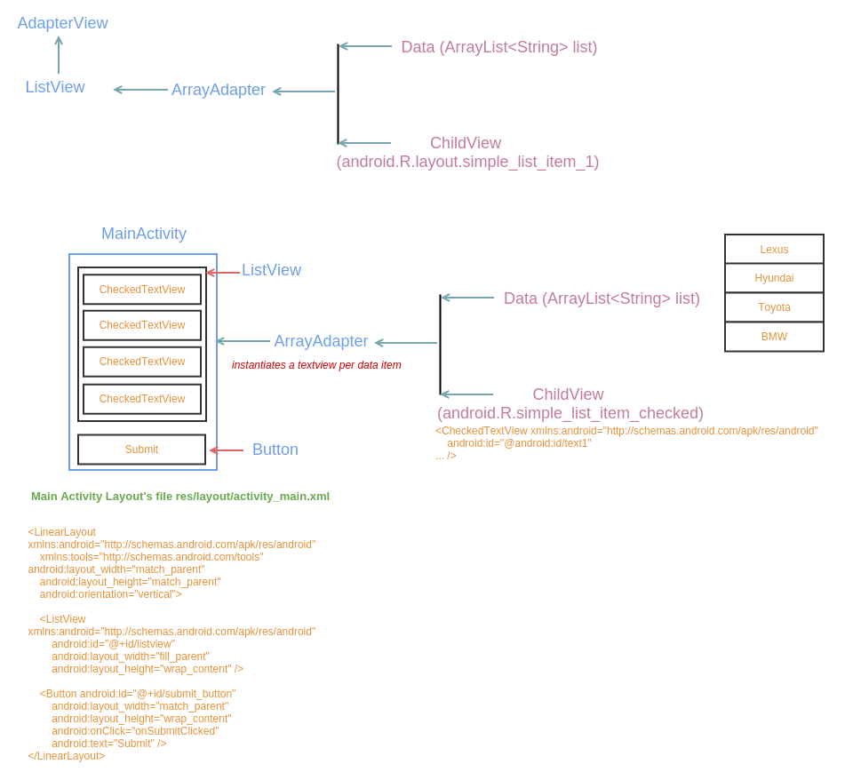
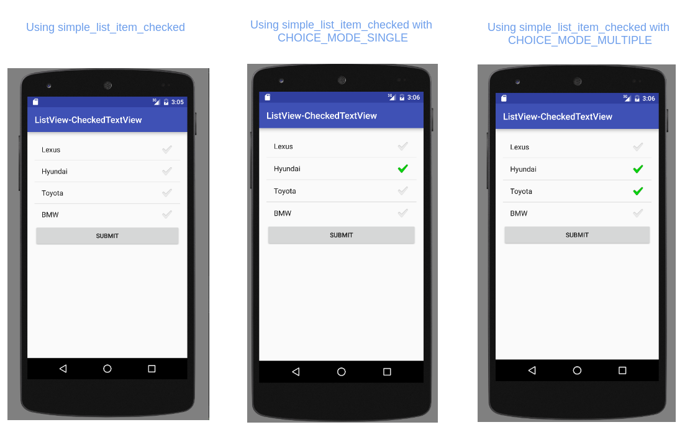
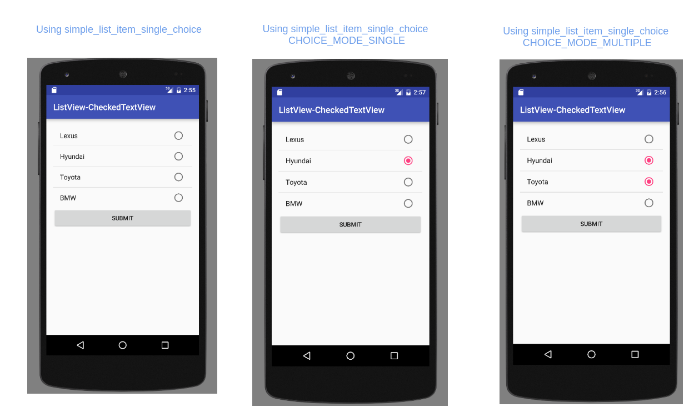

## Steps to follow

### Define a data source

```java
        // data source
        String[] makes = new String[] {
                "Lexus", "Hyundai", "Toyota", "BMW"
        };
        
        final ArrayList<String> list = new ArrayList<>();
        list.addAll(Arrays.asList(makes));
```

### Create an adapter

```java
        /*
            Create an adapter

            The responsibility of an adapter is to manage data and provide child views to the list control

            android.R.layout.simple_list_item_checked is a predefined layout for the child layout

            list is the data source
         */
        final ArrayAdapter<String> adapter1 = new ArrayAdapter<>(this,
                android.R.layout.simple_list_item_checked, list);
```

The resource ID for the Child Layout is <i>android.R.layout.simple_list_item_checked</i>, which is one of the predefined layouts 
in Android (it could be said from the prefix "android"). 

Instead of finding the resource files from local res/ directory, the predefined layouts are searched for in Android's 
res/ directory.


<i>sdk/platforms/\<platform-version\>/res/layout/simple_list_item_checked.xml</i>

```xml
<?xml version="1.0" encoding="utf-8"?>

<CheckedTextView xmlns:android="http://schemas.android.com/apk/res/android"
    android:id="@android:id/text1"
    android:layout_width="match_parent"
    android:layout_height="?android:attr/listPreferredItemHeightSmall"
    android:textAppearance="?android:attr/textAppearanceListItemSmall"
    android:gravity="center_vertical"
    android:checkMark="?android:attr/textCheckMark"
    android:paddingStart="?android:attr/listPreferredItemPaddingStart"
    android:paddingEnd="?android:attr/listPreferredItemPaddingEnd" />
```

The Adapter maps each data element from the data source to each instantiation of the child view, which in this case is android.R.layout.simple_list_item_checked. 

CheckedTextView extends TextView, intended to be used with ListViews.

### Get a reference to ListView

The Main Activity Layout's file res/layout/activity_main.xml is:

```xml
<LinearLayout xmlns:android="http://schemas.android.com/apk/res/android"
    xmlns:tools="http://schemas.android.com/tools" android:layout_width="match_parent"
    android:layout_height="match_parent" android:paddingLeft="@dimen/activity_horizontal_margin"
    android:paddingRight="@dimen/activity_horizontal_margin"
    android:paddingTop="@dimen/activity_vertical_margin"
    android:paddingBottom="@dimen/activity_vertical_margin" tools:context=".MainActivity"
    android:orientation="vertical">

    <ListView xmlns:android="http://schemas.android.com/apk/res/android"
        android:id="@+id/listview"
        android:layout_width="fill_parent"
        android:layout_height="wrap_content" />

    <Button android:id="@+id/submit_button"
        android:layout_width="match_parent"
        android:layout_height="wrap_content"
        android:onClick="onSubmitClicked"
        android:text="Submit" />
</LinearLayout>
```

The layout contains a ListView and a Button.

Get a reference to ListView

```java
final ListView listview = (ListView) findViewById(R.id.listview);
```

### Set the adapter

```java
/*
The list control calls getView() method of the adapter by passing in the index of the row that it wants to display
*/

listview.setAdapter(adapter1);
```

### Set selection mode

```java
        /*
            Set the choice mode to CHOICE_MODE_MULTIPLE to enable selection of multiple items

            By default, the choice mode is CHOICE_MODE_NONE
            Another possible value is CHOICE_MODE_SINGLE
         */
        listview.setChoiceMode(listview.CHOICE_MODE_MULTIPLE);
```

### Block Diagram



### Snapshots



### Set Event Handler

```java
        listview.setOnItemClickListener(new AdapterView.OnItemClickListener() {
            /*
                view: the view that received the click
                position: the position of item clicked in the ListView
                id: id of the data which depends on the adapter and the data source
                    In this case of using an array of strings, it would just be the index of the data element in the array
                    In case of a SimpleCursorAdapter that has read its values from the system's Contacts database, the id would
                        be the _ID of the record
             */
            @Override
            public void onItemClick(AdapterView<?> parent, View view, int position, long id) {
                String value = (String) listview.getItemAtPosition(position);

                Toast.makeText(getApplicationContext(), value, Toast.LENGTH_LONG).show();
            }
        });
```

### 'Submit' button's onClick Handler

<i>app/res/layout/activit_main.xml</i>

```xml
<?xml version="1.0" encoding="utf-8"?>
<LinearLayout xmlns:android="http://schemas.android.com/apk/res/android"
    xmlns:tools="http://schemas.android.com/tools" android:layout_width="match_parent"
    android:layout_height="match_parent" android:paddingLeft="@dimen/activity_horizontal_margin"
    android:paddingRight="@dimen/activity_horizontal_margin"
    android:paddingTop="@dimen/activity_vertical_margin"
    android:paddingBottom="@dimen/activity_vertical_margin" tools:context=".MainActivity"
    android:orientation="vertical">

    <ListView xmlns:android="http://schemas.android.com/apk/res/android"
        android:id="@+id/listview"
        android:layout_width="fill_parent"
        android:layout_height="wrap_content" />

    <Button android:id="@+id/submit_button"
        android:layout_width="match_parent"
        android:layout_height="wrap_content"
        android:onClick="onSubmitClicked"  <------
        android:text="Submit" />
</LinearLayout>
```

\>=Android 1 

supports ListView:getCheckedItemPositions()

<i>MainActivity.java</i>
```java
    public void onSubmitClicked(View view) {
        int numElements  = listview.getCount();

        //Get indices of selected items
        SparseBooleanArray selectedIndices = listview.getCheckedItemPositions();

        //Read items from the ListView based on indices of selected items
        for(int iter = 0; iter < numElements; iter++) {
            if(selectedIndices.get(iter)) {
                String carSelected = (String) listview.getItemAtPosition(iter);

                Log.v(TAG, carSelected + " at position " + iter + " is selected");
            }
        }
    }
```

\>=Android 1.6 - \<Android 2.2

supports ListView:getCheckItemIds()

\>=Android 2.2

supports ListView:getCheckedItemIds()

<hr>

## Using another child view (android.R.layout.simple_list_item_single_choice)

### Create an adapter

```java
        /*
            Create an adapter

            The responsibility of an adapter is to manage data and provide child views to the list control

            android.R.layout.simple_list_item_checked is a predefined layout for the child layout

            list is the data source
         */
        final ArrayAdapter<String> adapter1 = new ArrayAdapter<>(this,
                android.R.layout.simple_list_item_single_choice, list);
```

<i>sdk/platforms/\<platform-version\>/res/layout/simple_list_item_single_choice.xml</i>

```xml
<CheckedTextView xmlns:android="http://schemas.android.com/apk/res/android"
    android:id="@android:id/text1"
    android:layout_width="match_parent"
    android:layout_height="?android:attr/listPreferredItemHeightSmall"
    android:textAppearance="?android:attr/textAppearanceListItemSmall"
    android:gravity="center_vertical"
    android:checkMark="?android:attr/listChoiceIndicatorSingle"
    android:paddingStart="?android:attr/listPreferredItemPaddingStart"
    android:paddingEnd="?android:attr/listPreferredItemPaddingEnd" />

```

### Get a reference to ListView

same as above

### Set the adapter

same as above

### Set selection mode

```java
/*
        an apt choice for this would be to use listview.CHOICE_MODE_SINGLE,
        as the they appear to be radio buttons
        
        However, CHOICE_MODE_MULTIPLE and CHOICE_MODE_NONE can still be used
*/
listview.setChoiceMode(listview.CHOICE_MODE_SINGLE);
```

### Snapshots


