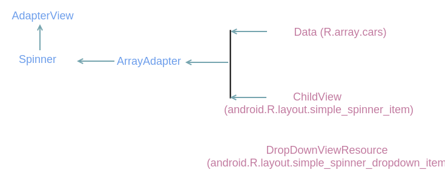

## Steps to follow

### Define a data source

The data source file in this example is a string resource file (res/values/cars.xml)

Remember, externalized 

```xml
<?xml version="1.0" encoding="utf-8"?>
<resources>
    <string-array name="cars">
        <item>Lexus NX</item>
        <item>BMW</item>
        <item>Toyota</item>
    </string-array>
</resources>
```

### Create an adapter

An ArrayAdapter can be created from a data source defined in a string resource file using the "createFromResource" method.

```java
        ArrayAdapter<CharSequence> adapter = ArrayAdapter.createFromResource(this, R.array.cars, android.R.layout.simple_spinner_item);
        
        adapter.setDropDownViewResource(android.R.layout.simple_spinner_dropdown_item);
```

The resource ID for the Child Layout is <i>android.R.layout.simple_spinner_item</i>, which is one of the predefined layouts
in Android (it could be said from the prefix "android"). 

<i>sdk/platforms/\<platform-version\>/res/layout/simple_spinner_item.xml</i>

```xml
<?xml version="1.0" encoding="utf-8"?>

<TextView xmlns:android="http://schemas.android.com/apk/res/android" 
    android:id="@android:id/text1"
    style="?android:attr/spinnerItemStyle"
    android:singleLine="true"
    android:layout_width="match_parent"
    android:layout_height="wrap_content"
    android:ellipsize="marquee"
    android:textAlignment="inherit"/>
```

<i>sdk/platforms/\<platform-version\>/res/layout/simple_spinner_dropdown_item.xml</i>

```xml
<?xml version="1.0" encoding="utf-8"?>

<CheckedTextView xmlns:android="http://schemas.android.com/apk/res/android"
    android:id="@android:id/text1"
    style="?android:attr/spinnerDropDownItemStyle"
    android:singleLine="true"
    android:layout_width="match_parent"
    android:layout_height="?android:attr/dropdownListPreferredItemHeight"
    android:ellipsize="marquee"/>
```

Instead of finding the resource files from local res/ directory, the predefined layouts are searched for in Android's 
res/ directory.

### Get a reference to SpinnerView

The Main Activity Layout's file res/layout/activity_main.xml is:

```xml
<Spinner xmlns:android="http://schemas.android.com/apk/res/android"
    android:id="@+id/spinner_view"
    android:layout_width="fill_parent"
    android:layout_height="wrap_content" />
```

Notice, ListView is the root element (not Spinner). Also, adding xmlns:android="http://schemas.android.com/apk/res/android" to the root element is a MUST.

Get a reference to Spinner

```java
Spinner spinner = (Spinner) findViewById(R.id.spinner_view);
```

### Set the adapter

```java
spinner.setAdapter(adapter);
```

### Block Diagram




### Set Event Handler

```java
        listview.setOnItemClickListener(new AdapterView.OnItemClickListener() {
            @Override
            public void onItemClick(AdapterView<?> parent, View view, int position, long id) {
                String value = (String) listview.getItemAtPosition(position);

                Toast.makeText(getApplicationContext(), value, Toast.LENGTH_LONG).show();
            }
        });
```

<hr>

### Using a custom layout with ArrayAdapter

Define a custom layout (res/layout/custom_list_row.xml)

```xml
<TextView xmlns:android="http://schemas.android.com/apk/res/android"
    android:id="@+id/rowText"
    android:layout_width="fill_parent"
    android:layout_height="wrap_content"
    android:textSize="20sp">
</TextView>
```
Notice that the root element is a TextView.

### Create an adapter

```java
        /*
            Create an adapter

            The responsibility of an adapter is to manage data and provide child views to the list control

            R.layout.custom_list_row is a custom layout for the child layout

            list is the data source
         */

        final ArrayAdapter<String> adapter2 = new ArrayAdapter<>(this,
                R.layout.custom_list_row, carsList);
```

### Set the adapter

```java
/*
The list control calls getView() method of the adapter by passing in the index of the row that it wants to display
*/

listview.setAdapter(adapter1);
```
