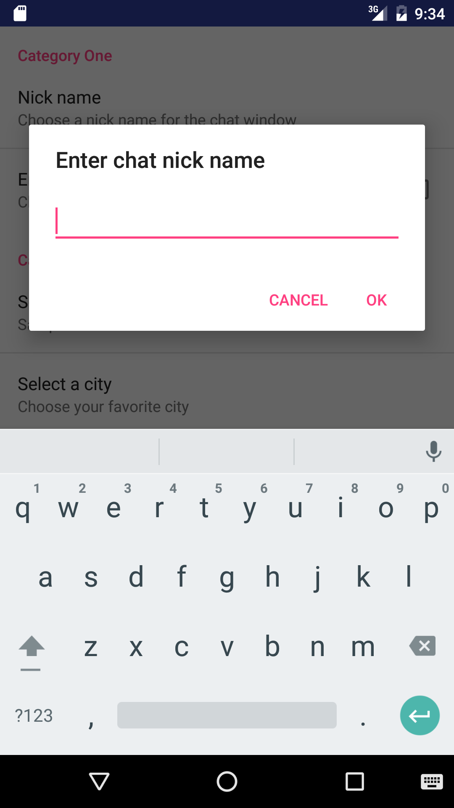
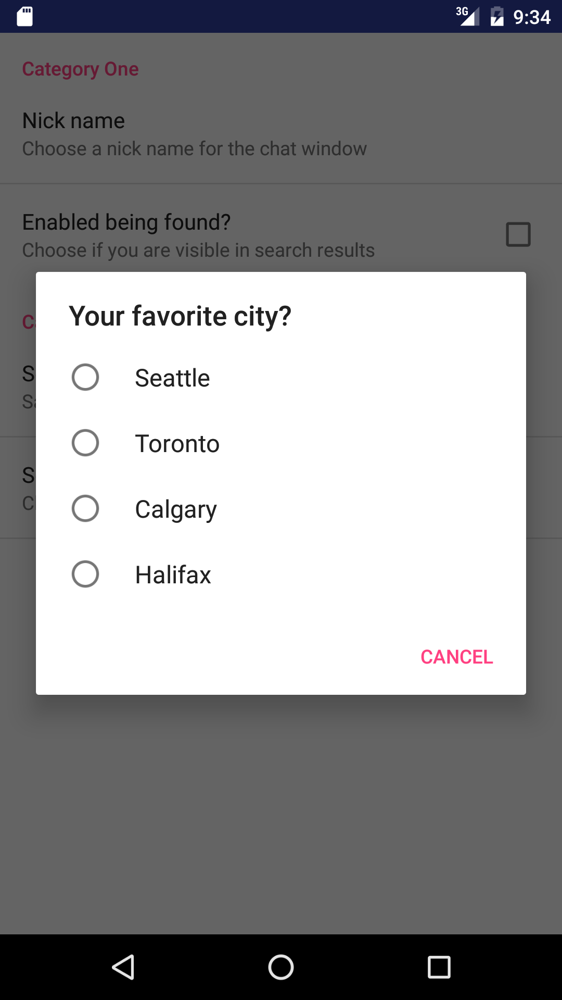
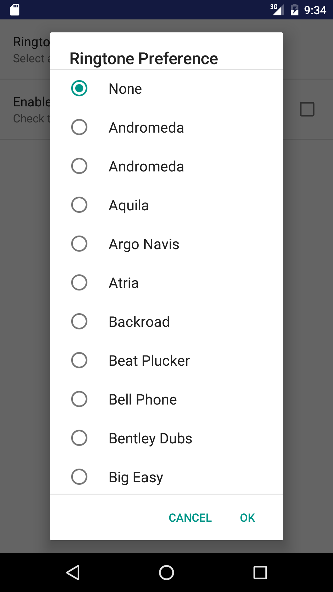

### Creating the project

The default activity code generated is 

*app\src\main\java\com\gruprog\basicpreferences\MainActivity.java*

```java
package com.gruprog.basicpreferences;

import android.support.v7.app.AppCompatActivity;
import android.os.Bundle;

public class MainActivity extends AppCompatActivity {

    @Override
    protected void onCreate(Bundle savedInstanceState) {
        super.onCreate(savedInstanceState);
        setContentView(R.layout.activity_main);
    }
}
```

The default layout file generated 

*app\src\main\res\layout\activity_main.xml*

```xml
<?xml version="1.0" encoding="utf-8"?>
<RelativeLayout xmlns:android="http://schemas.android.com/apk/res/android"
    xmlns:tools="http://schemas.android.com/tools"
    android:layout_width="match_parent"
    android:layout_height="match_parent"
    android:paddingBottom="@dimen/activity_vertical_margin"
    android:paddingLeft="@dimen/activity_horizontal_margin"
    android:paddingRight="@dimen/activity_horizontal_margin"
    android:paddingTop="@dimen/activity_vertical_margin"
    tools:context="com.gruprog.basicpreferences.MainActivity">

    <TextView
        android:layout_width="wrap_content"
        android:layout_height="wrap_content"
        android:text="Hello World!" />
</RelativeLayout>
```

Create the menu resource

*app\src\main\res\menu\menu_main.xml*

```xml
<?xml version="1.0" encoding="utf-8"?>
<menu xmlns:android="http://schemas.android.com/apk/res/android">
    <item
        android:id="@+id/settings"
        android:title="@string/settings"
        android:showAsAction="never"/>
</menu>
```


Fixing the error in the resource file

```xml
<?xml version="1.0" encoding="utf-8"?>
<menu
    xmlns:android="http://schemas.android.com/apk/res/android"
    xmlns:app="http://schemas.android.com/apk/res-auto">            <-------
    <item
        android:id="@+id/settings"
        android:title="@string/settings"
        app:showAsAction="never"/>
</menu>
```

**Inflate the menu**

Override the *onCreateOptionsMenu()* method and inflate the menu "menu_main.xml"

*app\src\main\java\com\gruprog\basicpreferences\MainActivity.java*

```java
package com.gruprog.basicpreferences;

import android.support.v7.app.AppCompatActivity;
import android.os.Bundle;
import android.view.Menu;

public class MainActivity extends AppCompatActivity {

    @Override
    protected void onCreate(Bundle savedInstanceState) {
        super.onCreate(savedInstanceState);
        setContentView(R.layout.activity_main);
    }

    @Override   
    public boolean onCreateOptionsMenu(Menu menu) {             <--------------
        getMenuInflater().inflate(R.menu.menu_main, menu);

        return true;
    }
}
```

Testing it in the emulator


**Create an Activity to launch on choosing "Settings" from the menu**

Create a new Empty Activity "SettingsActivity" in the package "com.gruprog.basicpreferences" with the following settings: 


The default content generated by the template is shown below.

*app\src\main\java\com\gruprog\basicpreferences\SettingsActivity.java*

```java
package com.gruprog.basicpreferences;

import android.support.v7.app.AppCompatActivity;
import android.os.Bundle;

public class SettingsActivity extends AppCompatActivity {

    @Override
    protected void onCreate(Bundle savedInstanceState) {
        super.onCreate(savedInstanceState);
    }
}
```

```java
package com.gruprog.basicpreferences;

import android.preference.PreferenceActivity;
import android.support.v7.app.AppCompatActivity;
import android.os.Bundle;

import java.util.List;

public class SettingsActivity extends PreferenceActivity {

    @Override
    public void onBuildHeaders(List<Header> preferenceHeaders) {
        loadHeadersFromResource(R.xml.preference_headers, preferenceHeaders);       <--------- 1a
    }
    
    @Override
    protected boolean isValidFragment(String fragmentName) {                <--------- 2a
        return SettingsFragment.class.getName().equals(fragmentName);       <--------- 3a
    }
}
```

1a

*app\src\main\res\xml\preference_headers.xml*

```xml
<?xml version="1.0" encoding="utf-8"?>
<preference-headers xmlns:android="http://schemas.android.com/apk/res/android">
    <header
        android:fragment="com.gruprog.basicpreferences.SettingsFragment"                            -------- 1b
        android:title="@string/group_1"                                                             -------- 2b
        android:summary="@string/summary_1">                                        
        <extra android:name="fragment_preference_resource" android:value="preference_group_1"/>     -------- 3b
    </header>
    <header
        android:fragment="com.gruprog.basicpreferences.SettingsFragment"
        android:title="@string/group_1"
        android:summary="@string/summary_2">
        <extra android:name="fragment_preference_resource" android:value="preference_group_2"/>
    </header>
</preference-headers>
```

**Creating the Fragment**


The default content generated by the template is shown below.

*app\src\main\java\com\gruprog\basicpreferences\SettingsFragment.java*

```java
package com.gruprog.basicpreferences;


import android.os.Bundle;
import android.support.v4.app.Fragment;
import android.view.LayoutInflater;
import android.view.View;
import android.view.ViewGroup;
import android.widget.TextView;

/**
 * A simple {@link Fragment} subclass.
 */
public class SettingsFragment extends Fragment {


    public SettingsFragment() {
        // Required empty public constructor
    }


    @Override
    public View onCreateView(LayoutInflater inflater, ViewGroup container,
                             Bundle savedInstanceState) {
        TextView textView = new TextView(getActivity());
        textView.setText(R.string.hello_blank_fragment);
        return textView;
    }

}
```

*app\src\main\res\values\strings.xml*

```xml
<resources>
    <string name="app_name">BasicPreferences</string>
    <string name="settings">Settings</string>
    <string name="group_1">Group One</string>
    <string name="summary_1">PreferenceScreen loads from res/xml/preference_group_1.xml</string>
    <string name="group_2">Group Two</string>
    <string name="summary_2">PreferenceScreen loads from res/xml/preference_group_2.xml</string>

    <!-- TODO: Remove or change this placeholder text -->
    <string name="hello_blank_fragment">Hello blank fragment</string>
</resources>
```

```java
package com.gruprog.basicpreferences;


import android.os.Bundle;
import android.preference.PreferenceFragment;
import android.support.v4.app.Fragment;
import android.view.LayoutInflater;
import android.view.View;
import android.view.ViewGroup;
import android.widget.TextView;

public class SettingsFragment extends PreferenceFragment {
    @Override
    public void onCreate(Bundle savedInstanceState) {
        super.onCreate(savedInstanceState);

        int preferencesResId = getActivity().getResources().getIdentifier(
                getArguments().getString("fragment_preference_resource"),
                "xml",
                getActivity().getPackageName());

        addPreferencesFromResource(preferencesResId);
    }
}
```

*app\src\main\res\values\strings.xml*

```xml
<resources>
    <string name="app_name">BasicPreferences</string>
    <string name="settings">Settings</string>
    <string name="group_1">Group One</string>
    <string name="summary_1">PreferenceScreen loads from res/xml/preference_group_1.xml</string>
    <string name="group_2">Group Two</string>
    <string name="summary_2">PreferenceScreen loads from res/xml/preference_group_2.xml</string>
</resources>
```

*app\src\main\res\xml\preference_group_1.xml*

```xml
<?xml version="1.0" encoding="utf-8"?>
<PreferenceScreen xmlns:android="http://schemas.android.com/apk/res/android">
    <PreferenceCategory
        android:title="Category One">
        <EditTextPreference
            android:key="text1"
            android:title="Nick name"
            android:summary="Choose a nick name for the chat window"
            android:dialogTitle="Enter chat nick name"/>

        <CheckBoxPreference
            android:key="checkbox1"
            android:title="Enabled being found?"
            android:summary="Choose if you are visible in search results"/>
    </PreferenceCategory>

    <PreferenceCategory
        android:title="Category Two">

        <SwitchPreference
            android:key="Select"
            android:title="Selection"
            android:summary="Sample selection"/>

        <ListPreference
            android:key="list"
            android:title="Select a city"
            android:entries="@array/cities"
            android:entryValues="@array/ids"
            android:dialogTitle="Your favorite city?"
            android:summary="Choose your favorite city"/>
            
    </PreferenceCategory>

</PreferenceScreen>
```

*app\src\main\res\values\arrays.xml*

```xml
<?xml version="1.0" encoding="utf-8"?>
<resources>
    <string-array name="cities">
        <item>Seattle</item>
        <item>Toronto</item>
        <item>Calgary</item>
        <item>Halifax</item>
    </string-array>
    <string-array name="ids">
        <item>10</item>
        <item>11</item>
        <item>12</item>
        <item>13</item>
    </string-array>
</resources>
```

*app\src\main\res\xml\preference_group_2.xml*

```xml
<?xml version="1.0" encoding="utf-8"?>
<PreferenceScreen xmlns:android="http://schemas.android.com/apk/res/android">
    <RingtonePreference
        android:key="ringtone"
        android:title="Ringtone Preference"
        android:showDefault="true"
        android:showSilent="true"
        android:summary="Select a ringtone"/>

    <CheckBoxPreference
        android:key="Enable?"
        android:title="Enable Ringtone?"
        android:summary="Check to enable Ringtone"/>
</PreferenceScreen>
```

**Wiring the "SettingsActivity" with the "Settings" menu item**

```java
package com.gruprog.basicpreferences;

import android.content.Intent;
import android.support.v7.app.AppCompatActivity;
import android.os.Bundle;
import android.view.Menu;
import android.view.MenuItem;

public class MainActivity extends AppCompatActivity {

    @Override
    protected void onCreate(Bundle savedInstanceState) {
        super.onCreate(savedInstanceState);
        setContentView(R.layout.activity_main);
    }

    @Override
    public boolean onCreateOptionsMenu(Menu menu) {
        getMenuInflater().inflate(R.menu.menu_main, menu);

        return true;
    }

    @Override
    public boolean onOptionsItemSelected(MenuItem item) {               <--------------
        int id = item.getItemId();

        if(id == R.id.settings) {
            startActivity(new Intent(this, SettingsActivity.class));    <--------------

            return true;
        }

        return super.onOptionsItemSelected(item);
    }
}
```







